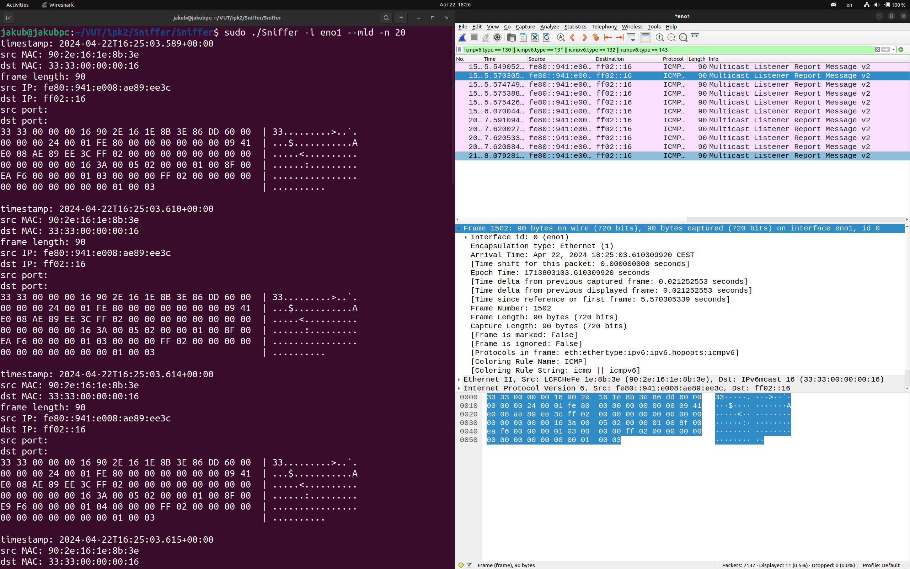
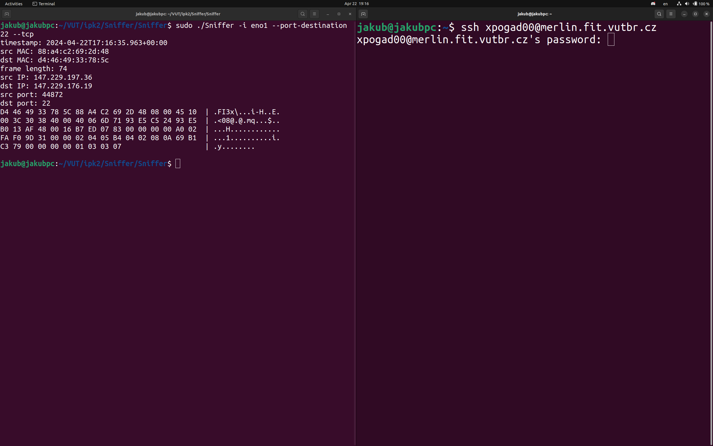
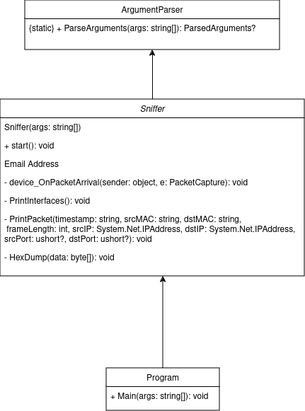

# IPK project 2 - Sniffer
**Author:** Jakub Pogadl (xpogad00)  
**License:** AGPL-3.0

## Theory
### Sniffer
A packet sniffer — also known as a packet analyzer, protocol analyzer or network analyzer — is a piece of hardware or software used to monitor network traffic. Sniffers work by examining streams of data packets that flow between computers on a network as well as between networked computers and the larger Internet. These packets are intended for — and addressed to — specific machines, but using a packet sniffer in "promiscuous mode" allows IT professionals, end users or malicious intruders to examine any packet, regardless of destination. It's possible to configure sniffers in two ways. The first is "unfiltered," meaning they will capture all packets possible and write them to a local hard drive for later examination. Next is "filtered" mode, meaning analyzers will only capture packets that contain specific data elements.## Example Usage
### TCP
TCP organizes data so that it can be transmitted between a server and a client. It guarantees the integrity of the data being communicated over a network. Before it transmits data, TCP establishes a connection between a source and its destination, which it ensures remains live until communication begins. It then breaks large amounts of data into smaller packets, while ensuring data integrity is in place throughout the process.
### UDP
An alternative to TCP in networking is the User Datagram Protocol (UDP), which is used to establish low-latency connections between applications and decrease transmissions time. UDP does not provide error connection or packet sequencing nor does it signal a destination before it delivers data, which makes it less reliable but less expensive.
### Interface
A network interface is the point of interconnection between a computer and a private or public network. A network interface is generally a network interface card (NIC), but does not have to have a physical form. Instead, the network interface can be implemented in software. For example, the loopback interface (127.0.0.1 for IPv4 and ::1 for IPv6) is not a physical device but a piece of software simulating a network interface. The loopback interface is commonly used in test environments.
### ICMP
ICMP is used for reporting errors and management queries. It is a supporting protocol and is used by network devices like routers for sending error messages and operations information. For example, the requested service is not available or a host or router could not be reached.
### ARP
The Address Resolution Protocol (ARP) is a communication protocol used for discovering the link layer address, such as a MAC address, associated with a given internet layer address, typically an IPv4 address. This mapping is a critical function in the Internet protocol suite.
### NDP
The Neighbor Discovery Protocol (NDP), or simply Neighbor Discovery (ND), is a protocol of the Internet protocol suite used with Internet Protocol Version 6 (IPv6). It operates at the internet layer of the Internet model, and is responsible for gathering various information required for network communication, including the configuration of local connections and the domain name servers and gateways.
### IGMP
IGMP is acronym for Internet Group Management Protocol. IGMP is a communication protocol used by hosts and adjacent routers for multicasting communication with IP networks and uses the resources efficiently to transmit the message/data packets. Multicast communication can have single or multiple senders and receivers and thus, IGMP can be used in streaming videos, gaming or web conferencing tools.
### MLD
Multicast Listener Discovery (MLD) is a component of the Internet Protocol Version 6 (IPv6) suite. MLD is used by IPv6 routers for discovering multicast listeners on a directly attached link, much like Internet Group Management Protocol (IGMP) is used in IPv4. The protocol is embedded in ICMPv6 instead of using a separate protocol.

## Execution example
```bash
sudo ./ipk-sniffer -i eno1 --port-destination 22 --tcp
```

## Command line arguments
- `-i or --interface` - specifies interface
- `-t or --tcp` - displays tcp packets
- `-u or --udp` - displays udp packets
- `-p` - sets port
- `--port-destination` - specifies destination port
- `--port-source` - specifies source port
- `--icmp4` - displays icmp4 packets
- `--icmp6` - displays icmp6 packets
- `--arp` - displays arp frames
- `--ndp` - displays ndp packets
- `--igmp` - displays igmp packets
- `--mld` - displays mld packets
- `-n` - specifies the number of packets

## Testing
The application was developed and tested on Ubuntu 22.04.LTS. It was mainly tested using wireshark and tcpdump tools.



## Implementation
The application is implemented in C# using .NET 8.0 framework. Application uses PacketDotNet and SharpPcap libraries to capture and analyze network traffic.

## Design
The application is designed as a console application. Class ArgumentParser is responsible for parsing command line arguments. Class Sniffer is responsible for capturing and analyzing network traffic. Class Program is the entry point of the application.



## Output
Output is displayed in the following format:
```
timestamp: 2024-04-22T19:37:52.297+00:00
src MAC: d2:73:69:71:78:4c
dst MAC: 66:a4:c2:43:2d:25
frame length: 235
src IP: 132.149.163.84
dst IP: 512.286.172.33
src port: 443
dst port: 42280

88 A4 C2 69 2D 48 D4 46 49 33 78 5C 08 00 45 00  ...i-H.FI3x\..E.
00 DD FC CE 40 00 3A 06 C1 B8 A2 9F 85 EA 93 E5  ....@.:.........
C5 24 01 BB A5 28 64 3D DD 54 A7 5C 16 06 80 18  .$...(d=.T.\....
00 08 A1 34 00 00 01 01 08 0A CD 84 2F 52 81 2A  ...4......../R.*
34 FD 17 03 03 00 A4 26 19 01 F9 40 D2 63 65 EE  4......&...@.ce.
5D BC CE E1 C8 3F 02 CB 01 65 05 51 41 C2 05 F8  ]....?...e.QA...
1B 74 1E 69 4B 79 D4 22 4E 35 AB 4F 29 71 DD CE  .t.iKy."N5.O)q..
51 FE C7 5D C1 5E C1 36 F6 54 8A 1F 94 74 58 5E  Q..].^.6.T...tX^
A4 BB 47 B8 63 1E F3 3D BB 99 C0 F4 0F D8 FF FE  ..G.c..=........
AC 92 67 5B 06 6E 0A 65 E3 B8 E8 19 E7 F9 FE 46  ..g[.n.e.......F
FF 44 87 5C 5B 59 12 B1 F8 62 CA CE 9E 34 FC 52  .D.\[Y...b...4.R
8F 4D 3C 3F 12 1C 4F 64 4D 8A 8C 43 F1 AF 6B 1F  .M<?..OdM..C..k.
3B 03 F4 3B 2C 7B 32 90 8D A3 D0 50 71 CF 80 25  ;..;,{2....Pq..%
6C E3 C1 BF 70 3F 0C 91 EE 4D 87 28 84 52 0B A9  l...p?...M.(.R..
B0 6C EE DB 1B EC 4D 3B D4 71 80                 .l....M;.q.
```


## Bibliography
[Oracle] Networking Interfaces [online]. [cited 2024-04-22]. Available at: https://docs.oracle.com/javase/tutorial/networking/nifs/definition.html
[Fortinet] TCP/IP [online]. [cited 2024-04-22]. Available at: https://www.fortinet.com/resources/cyberglossary/tcp-ip
[Kaspersky] Packet Sniffer [online]. [cited 2024-04-22]. Available at: https://www.kaspersky.com/resource-center/definitions/what-is-a-packet-sniffer
[Dotpcap] PacketDotNet [online]. Available at: https://github.com/dotpcap/packetnet
[Dotpcap] SharpPcap [online]. Available at: https://github.com/dotpcap/sharppcap
[Wireshark] Wireshark [online]. [cited 2024-04-22]. Available at: https://www.wireshark.org/
[Tcpdump] Tcpdump [online]. [cited 2024-04-22]. Available at: https://www.tcpdump.org/
[GeeksforGeeks] Internet Control Message Protocol (ICMP) [online]. Available at: https://www.geeksforgeeks.org/internet-control-message-protocol-icmp/
[Wikipedia] Address Resolution Protocol [online]. Available at: https://en.wikipedia.org/wiki/Address_Resolution_Protocol
[Wikipedia] Multicast Listener Discovery [online]. Available at: https://en.wikipedia.org/wiki/Multicast_Listener_Discovery
[GeeksforGeeks] Internet Group Management Protocol (IGMP) [online]. Available at: https://www.geeksforgeeks.org/what-is-igmpinternet-group-management-protocol/
[Wikipedia] Neighbor Discovery Protocol [online]. Available at: https://en.wikipedia.org/wiki/Neighbor_Discovery_Protocol