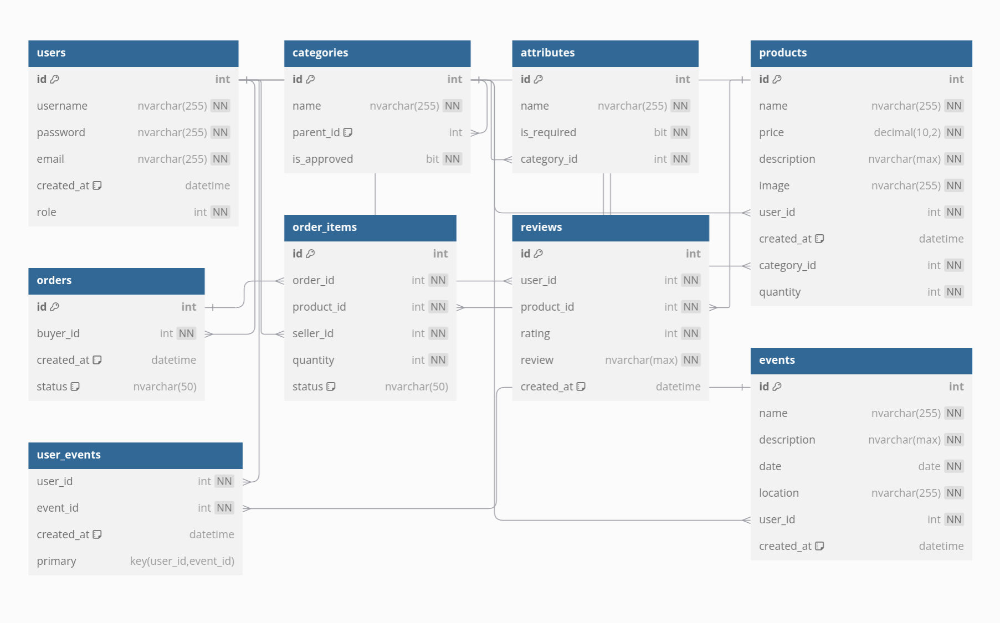

# Zelny trh

## Autoři
- **Marek Sucharda** - frontend  
  [xsucha18@stud.fit.vutbr.cz](mailto:xsucha18@stud.fit.vutbr.cz)
- **Jakub Pogádl** - backend (model, controller)  
  [xpogad00@stud.fit.vutbr.cz](mailto:xpogad00@stud.fit.vutbr.cz)
- **Boris Semanco** - backend (model, controller)  
  [xseman06@stud.fit.vutbr.cz](mailto:xseman06@stud.fit.vutbr.cz)

## URL aplikace
- [https://vagosturbo.github.io/zelnak-app/](https://vagosturbo.github.io/zelnak-app/)
- ⚠️ Pri prvom spustení a vyhľadaní prvého dotazu je potrebné chvíľu počkať, kým sa backendový server "prebudí". Keďže je hostovaný zadarmo, môže to trvať až minútu, no po tejto dobe by už malo byť všetko v poriadku.

## Uživatelé systému pro testování

| Login       | Heslo   | Role                |
|-------------|---------|---------------------|
| admin       | admin   | Administrátor       |
| farmer1     | farmer1 | Farmár              |
| user1       | user1   | Zákazník            |
| registered  | registered | Registrovaný uživatel |

**Registrovaný používateľ** - stane sa buď farmárom, alebo zákazníkom na základe jeho akcií.  
**Zákazník** - vytvára objednávky, môže sa prihlásiť na samozber.  
**Farmár** - vytvára produkty, udalosti, spravuje objednávky jeho produktov.  
**Moderátor** - schvaľuje kategórie, spravuje kategórie.  
**Admin** - spravuje používateľov.

## Video
- [https://youtu.be/crQ47f7uLNQ](https://youtu.be/crQ47f7uLNQ)

## Implementace
Backend je implementovaný v Node.js a Express.js. Backend komunikuje s databázou Microsoft SQL Server.  
Autentifikácia a autorizácia sú implementované pomocou JWT tokenov. Projekt využíva MVC architektúru.

### MVC Architektúra
- **Model**:  
  Model predstavuje dátovú vrstvu aplikácie. Rieši komunikáciu s databázou. Pre každú entitu je vytvorený model, ktorý obsahuje metódy na prístup k databáze. Modely sú zodpovedné za vykonávanie CRUD operácií (Create, Read, Update, Delete).
- **Controller**:  
  Controller predstavuje riadiacu vrstvu aplikácie. Rieši spracovanie požiadaviek od frontendu a volanie metód modelu. Kontroléry spracovávajú HTTP požiadavky, volajú príslušné metódy modelu a vracajú odpovede klientovi.
- **View**:  
  View, riešený pomocou React.js, predstavuje prezentačnú vrstvu aplikácie. Zobrazuje dáta získané z backendu a umožňuje používateľom interakciu s aplikáciou. Komponenty Reactu komunikujú s kontrolérmi prostredníctvom HTTP požiadaviek.

### Technológie
- **Node.js**: JavaScript runtime na budovanie serverových aplikácií.
- **Express.js**: Webový rámec pre Node.js na budovanie RESTful API.
- **Microsoft SQL Server**: Relačný databázový systém.
- **JWT**: JSON Web Tokens na bezpečnú autentifikáciu.
- **dotenv**: Modul na načítanie environmentálnych premenných z .env súboru.
- **bcrypt**: Knižnica na hashovanie hesiel.

### API Endpointy
- **User routes** (/users)
  - GET /: Načítanie všetkých používateľov (len admin).
  - GET /:id: Načítanie detailov používateľa podľa ID.
  - PUT /:id: Aktualizácia údajov používateľa.
  - DELETE /:id: Vymazanie používateľa.
  - POST /:userId/events: Pridanie používateľa na udalosť.
  - DELETE /:userId/events/:eventId: Odstránenie používateľa z udalosti.
  - GET /:userId/registeredevents: Načítanie udalostí, na ktoré je používateľ registrovaný.
  - GET /:id/events: Načítanie udalostí vytvorených používateľom.
  - GET /:id/products: Načítanie produktov vytvorených používateľom.
- **Product routes** (/products)
  - GET /: Načítanie všetkých produktov.
  - GET /:id: Načítanie detailov produktu podľa ID.
  - POST /: Vytvorenie nového produktu.
  - PUT /:id: Aktualizácia existujúceho produktu.
  - DELETE /:id: Vymazanie produktu.
- **Order routes** (/orders)
  - GET /: Načítanie všetkých objednávok (len admin).
  - GET /:id: Načítanie detailov objednávky podľa ID.
  - POST /: Vytvorenie novej objednávky.
  - PUT /:id: Aktualizácia existujúcej objednávky.
  - DELETE /:id: Vymazanie objednávky.
  - GET /user/:id: Načítanie objednávok podľa ID používateľa.
  - POST /:orderId/items: Pridanie položky do objednávky.
  - GET /:orderId/items: Načítanie položiek objednávky podľa ID objednávky.
  - PUT /items/:id: Aktualizácia položky objednávky.
  - DELETE /items/:id: Vymazanie položky objednávky.
  - GET /:sellerId/items/: Načítanie položiek objednávky podľa ID predajcu.
  - PUT /items/:id/approve: Schválenie položky objednávky.
- **Event routes** (/events)
  - GET /: Načítanie všetkých udalostí.
  - GET /:id: Načítanie detailov udalosti podľa ID.
  - POST /: Vytvorenie novej udalosti.
  - PUT /:id: Aktualizácia existujúcej udalosti.
  - DELETE /:id: Vymazanie udalosti.
- **Category routes** (/categories)
  - GET /: Načítanie všetkých kategórií.
  - GET /:id: Načítanie detailov kategórie podľa ID.
  - POST /: Vytvorenie novej kategórie.
  - PUT /:id: Aktualizácia existujúcej kategórie.
  - DELETE /:id: Vymazanie kategórie.
  - GET /:categoryId/hierarchy: Načítanie hierarchie kategórie.
  - PUT /:id/toggle: Schválenie alebo zamietnutie kategórie.
- **Attribute routes** (/attributes)
  - GET /category/:categoryId: Načítanie atribútov podľa ID kategórie.
  - POST /: Vytvorenie nového atribútu.
  - PUT /:id: Aktualizácia existujúceho atribútu.
  - DELETE /:id: Vymazanie atribútu.
- **Auth routes** (/register, /login)
  - POST /register: Registrácia nového používateľa.
  - POST /login: Autentifikácia používateľa a vrátenie JWT.

## Databáze


## Instalace
Inštalácia FE a BE lokálne, databáza beží vzdialene.

### Postup
1. Rozbalenie repozitára
2. V `root` adresári spustite príkaz:
   ```bash
   npm install
   ```
3. V adresári `backend2.0` spustite príkaz:
   ```bash
   npm install
   ```
4. V adresári `frontend` spustite príkaz:
   ```bash
   npm install
   ```
5. Do adresára `frontend` pridajte súbor `.env` s nasledujúcou premennou:
   ```bash
   VITE_API_URL=http://localhost:3000
   ```
6. Do adresára `backend2.0` pridajte súbor `.env` s nasledujúcimi premennými:
   ```bash
   PORT=3000
    DB_HOST=zelnak-db.database.windows.net
    DB_USER=admin123
    DB_PASSWORD=zrGCIYwIgV.
    DB_DATABASE=zelnak-db
    JWT_SECRET=s5gJK2rUUSM1cqH1BBhZGXeXHR3KmH9wMyJT7Jdhlr0=
    DB_PORT=1433
   ```
7. V root adresári spustite príkaz:
   ```bash
   npm run dev
   ```
   Tento príkaz spustí frontend aj backend server súčasne. Backend server bude bežať na `http://localhost:3000` a frontend server bude komunikovať s backendom cez túto URL.
   
